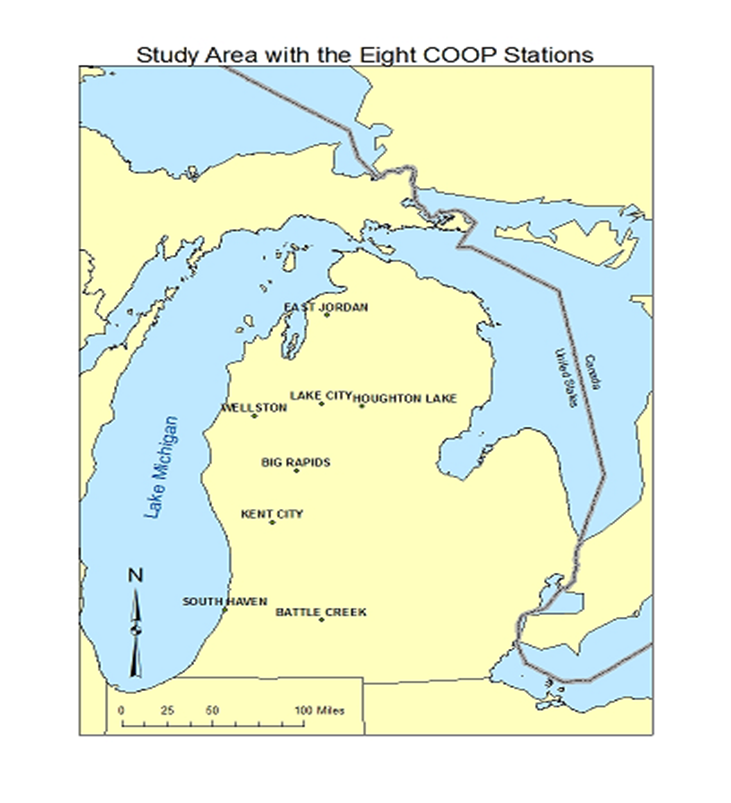
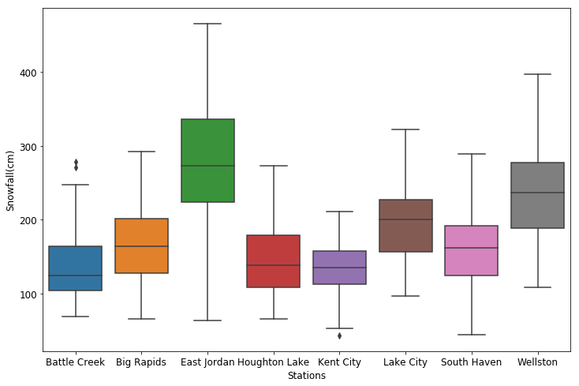
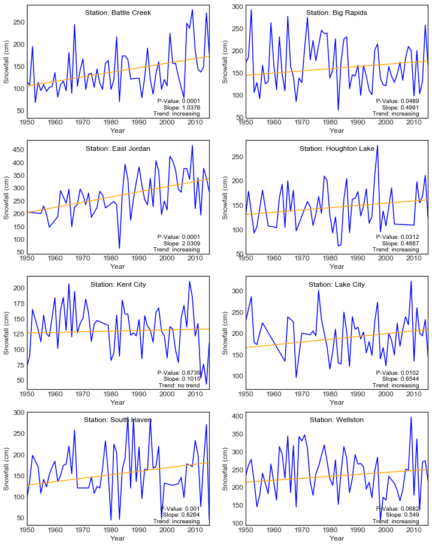
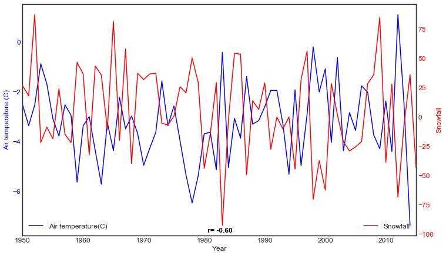

# Study of snowfall in the lower penninsula of Michigan(LPM) 
## Introcution

Variation of the snowfall and the statistical relationship between snowfall and air temperature is studied. Monthy snowfall data for 8 stations in LPM from 1950 to 2015 is obtained from National Wether Service's (NWS's) cooperative observer network (COOP)(accessible at https://www.ncdc.noaa.gov/data-access/land-based-station-data/land-based-datasets/cooperative-observer-network-coop). Monthly air temperature data is obtained from the Parameter-elevation Relationship on independent slope model (PRISM) working group at Oregan State University(accessible at http://www.prism.oregonstate.edu/).

<b>Fig: Study area </b>

## Statistics of snowfall in the eight stations of LPM
Mean snowfall(cm), the statndard deviation, the minimum and the maximul snowfall of the stations in 65 years is shown below.

<b>Fig: Bos and whisker showing distribution of snowfall data of each station</b>

Mann-Kendall test is used to do the trend alalysis. Mann-Kendall test is commonly used test with a null hypothesis taht the data are independent and randomly placed.

<b>Fig: Trends of annual averaged snowfall in 8 stations</b>

## Corelation between average annual snowfall and air temperature

A strong negative correlation (r = -0.74, p-value = 0.0001) is found between snowfall and the air temperature.

<b>Fig: Pearson's correlation between air temperature and annual snowfall</b>

## Conclusion
This study of long term climate data for 8 stations in the LPM suggests that air temperature is correlated (r = -0.74) with the snowfall.